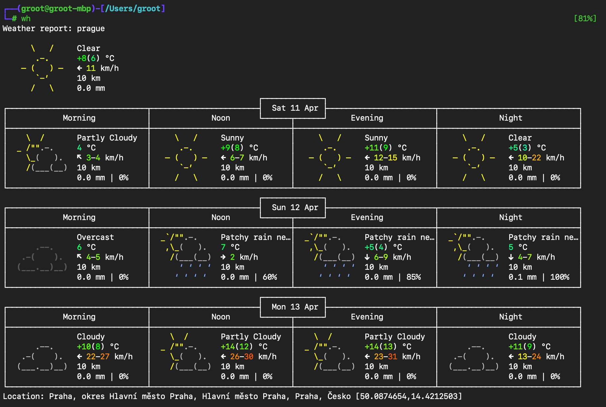

# .zshrc

<h4 align="center">Hello there! Here you will find zsh configuration and practical aliases, functions, settings, integrations 🐁</h4>

<h4 align="center">
  <a href="https://github.com/kraloveckey/zshrc"></a> <br> <br> <p align="center"> » <b><code><a href="https://github.com/kraloveckey/zshrc/issues">All suggestions are welcome</a></code></b> « <br><br></p>
</h4>


> [!NOTE]
> Over time, you realize that you spend half your time in the terminal typing the same thing over and over. A couple of small functions in `~/.zshrc` can save you hours. These functions are usually unique to each person, but maybe this list will open your eyes to something new.
> 
> You can also find useful settings (`History`, `Terminal Interface`, `Environment Variables`) and integrations (`battery`, `macos`, `zsh-autosuggestions`, `zshclean`, `zsh-syntax-highlighting`, `zsh-completions`, `git-flow-completion` and optional `ghost-complete`).

**.zshrc**:

```shell
# -----------------------
# ZSH + Oh My Zsh setup
# -----------------------
#
# Install Zsh:
#
# macOS:
#   brew install zsh
#
# Linux (Debian/Ubuntu):
#   sudo apt update && sudo apt install zsh
#
# Set as default shell:
#   chsh -s $(which zsh)
#
# Install Oh My Zsh:
#   https://github.com/ohmyzsh/ohmyzsh/wiki/Installing-ZSH
#
# Quick install:
#   sh -c "$(curl -fsSL https://raw.githubusercontent.com/ohmyzsh/ohmyzsh/master/tools/install.sh)"
#
# Note:
# This config does NOT depend on oh-my-zsh.
# Plugins below are loaded manually for portability.
#
# -----------------------
# Terminal autocomplete engine inspired by Fig
# -----------------------
#
# Install ghost-complete:
#   https://github.com/StanMarek/ghost-complete
#
# Quick install:
#   brew install StanMarek/tap/ghost-complete
#   ghost-complete install
#
# Multi-terminal support is available but disabled by default. 
# To enable it, add to ~/.config/ghost-complete/config.toml:
#
# [experimental]
# multi_terminal = true

# ~~~~~~~~~~~~~~~ History ~~~~~~~~~~~~~~~~~~~~~~~~
HISTFILE=${ZDOTDIR:-$HOME}/.zsh_history
HISTSIZE=100000
SAVEHIST=100000

setopt HIST_IGNORE_SPACE  # Don't save when prefixed with space
setopt HIST_IGNORE_DUPS   # Don't save duplicate lines
setopt SHARE_HISTORY      # Share history between sessions
setopt EXTENDED_HISTORY

# ~~~~~~~~~~~~~~~ Terminal Interface ~~~~~~~~~~~~~~~~~~~~~~~~

PROMPT=$'%F{blue}%B┌──%B(%B%F{green}%n@%m%b%F{blue}%B)-%B[%F{cyan}%d%F{blue}%B]%F{011}
%F{blue}%B└─%B%F{green}#%b%F{reset} '

# ~~~~~~~~~~~~~~~ Battery ~~~~~~~~~~~~~~~~~~~~~~~~

autoload -U colors && colors
BATTERY_CHARGING="⚡️️"
BATTERY_SHOW_WATTS=true
setopt prompt_subst
RPROMPT='$(battery_pct_prompt)'

# ~~~~~~~~~~~~~~~ Environment Variables ~~~~~~~~~~~~~~~~~~~~~~~~

export LANG="en_US.UTF-8"
export CLICOLOR=1
export LSCOLORS=GxFxCxDxBxegedabagaced
export VISUAL="/Applications/Visual\ Studio\ Code.app/Contents/Resources/app/bin/code"
export EDITOR=nano
export TERM="tmux-256color"

# ~~~~~~~~~~~~~~~ Aliases / Functions ~~~~~~~~~~~~~~~~~~~~~~~~

# ls: Colorized directory listing
alias ls='ls --color=auto'

# la: List all files (long format, human-readable, sorted by time), includes hidden files, newest last
alias la='ls -lathr'

# ll: Detailed file listing, long format with human-readable sizes
alias ll='ls -lah'

# mkey: Generate SSH key (RSA 4096-bit)
# Usage: mkey ~/.ssh/id_rsa_custom
mkey() {
    ssh-keygen -t rsa -b 4096 -f "$1"
}

# rusts: Full TCP port scan with rustscan + nmap scripts
# Usage: rusts 192.168.1.1
rusts() {
    sudo rustscan --ulimit=5000 --range=1-65535 -a "$1" -- -A -sC
}

# mkcd: Create directory (with parents) and cd into it immediately
mkcd() {
  mkdir -p "$1" && cd "$1"
}

# hist: Search your Command History
hist() {
  history 1 | grep -i "$1"
}

# h: Show last commands
h() {
  fc -l -n -${1:-$1}
}

# ff: Fast recursive file finder (name search)
# ff .pdf    → finds all PDFs anywhere below current dir
ff() {
  find . -type f -iname "*$1*" 2>/dev/null
}

# fd: Find directories by name
fd() {
  find . -type d -iname "*$1*" 2>/dev/null
}

# serve: Quick Python HTTP server (Python 3)
serve() {
  local port=${1:-8000}
  echo "Serving on http://localhost:$port"
  python3 -m http.server "$port"
}

# path: Pretty-print your $PATH
path() {
  echo "$PATH" | tr ":" "\n"
}

# mans: Search within a Man page
# Usage: mans tar extract  -> Shows 'tar' man page entries near 'extract'
mans() {
  man "$1" | grep -iC 5 "$2"
}

# colors: Display 256-color terminal test palette
colors() {
  for i in $(seq 0 255); do
    printf '\e[48;5;%dm%3d ' "$i" "$i"
    [ $(( (i+3) % 18 )) -eq 0 ] && printf '\e[0m\n'
  done
  printf '\e[0m\n'
}

# tre: A "Better" Tree
tre() {
  tree -aC -I '.git|node_modules|vendor|__pycache__' --dirsfirst "$@" | less -FRNX
}

# ports What's listening?
ports() {
  lsof -iTCP -sTCP:LISTEN -P -n
  # ss -tuln
}

# git-undo: The "Panic Button"
git-undo() {
  git reset --soft HEAD~1
}

# gcap: Git "Commit All and Push"
# Usage: gcap "Fixed the header padding and updated README"
gcap() {
  git add . && git commit -m "$*" && git push
}

# extract-ip: Pull IPs from any text
# Usage: extract-ip access.log
extract-ip() {
  grep -oE "\b([0-9]{1,3}\.){3}[0-9]{1,3}\b" "$1" | sort -u
}

# top-size: Find the space hogs
top-size() {
  du -hs * | sort -rh | head -10
}

# dirsize: Check the size of the directory
dirsize() {
  du -sh "$1"
}

# up: Go up a few levels
up() {
  local n=${1:-1}
  local d=""
  for ((i=1;i<=n;i++)); do
    d+="../"
  done
  cd "$d" || return
}

# psg: Find a process
psg() {
  ps aux | grep -i "$1" | grep -v grep
}

# extract: Universal archive extraction
extract() {
  if [ -f "$1" ]; then
    case "$1" in
      *.tar.bz2) tar xjf "$1" ;;
      *.tar.gz) tar xzf "$1" ;;
      *.bz2) bunzip2 "$1" ;;
      *.rar) unrar x "$1" ;;
      *.gz) gunzip "$1" ;;
      *.tar) tar xf "$1" ;;
      *.tbz2) tar xjf "$1" ;;
      *.tgz) tar xzf "$1" ;;
      *.zip) unzip "$1" ;;
      *.7z) 7z x "$1" ;;
      *) echo "unknown archive" ;;
    esac
  fi
}

# wh: Quick weather check via wttr.in
alias wh='curl wttr.in'

# myip: Check your public IP address
myip() {
  curl -s ifconfig.io
}

# ipinfo: Find a domain's IP address
ipinfo() {
  dig +short "$1"
}

# cls: Complete terminal cleaning
cls() {
  clear && printf '\e[3J'
}

# ttyshare: Share terminal session (read-only, public). Useful for demos or remote debugging
alias ttyshare='tty-share --public --readonly'

# ttykill: Kill all tty-share sessions. Finds and terminates running tty-share processes
alias ttykill='kill $(ps aux | grep "tty-share" | awk "{print \$2}")'

# ar3: Add static route via utun3 interface (VPN tunnel)
# Usage: ar3 10.10.10.10
ar3() {
    sudo route add -host "$1" -interface utun3
}

# ar4: Add static route via utun4 interface (VPN tunnel)
# Usage: ar4 10.10.10.10
ar4() {
    sudo route add -host "$1" -interface utun4
}

# trash: Safe rm
trash() {
  ls -FCsd -- "$@"
  printf 'Delete? [y/N] '
  read ans
  if [ "$ans" = "y" ]; then
    command rm -rf -- "$@"
  fi
}

# dnsc: Flush DNS cache (macOS). Useful when DNS records change or resolution is broken
alias dnsc='sudo dscacheutil -flushcache;sudo killall -HUP mDNSResponder'

# update-stuff: Command-line interface for updating macOS (brew install mas)
alias update-stuff='echo "Updating Homebrew..." && brew update && brew upgrade && brew upgrade --cask --greedy && brew cleanup && echo "Updating App Store apps..." && mas upgrade && echo "Update finished!"'

# enable-touchid-sudo: Enable Touch ID authentication for sudo in macOS
enable-touchid-sudo() {
  sudo sed -i '.bak' '2s/^/auth       sufficient     pam_tid.so\'$'\n/g' /etc/pam.d/sudo
}

# ~~~~~~~~~~~~~~~ Integrations ~~~~~~~~~~~~~~~~~~~~~~~~

[[ -f "$HOME/.zsh/dotfile.zsh" ]] && builtin source "$HOME/.zsh/dotfile.zsh"
```

---

**dotfile.zsh**:

```shell
# dotfile.zsh

### battery – https://github.com/kraloveckey/zshrc/plugins/battery
if [ -d "$HOME/.zsh/plugins/battery" ]; then

source "$HOME/.zsh/plugins/battery/battery.plugin.zsh"
fi

### macos – https://github.com/zshzoo/macos
if [ -d "$HOME/.zsh/plugins/macos" ]; then

source "$HOME/.zsh/plugins/macos/macos.zsh"
fi

### zsh-autosuggestions – https://github.com/zsh-users/zsh-autosuggestions
if [ -d "$HOME/.zsh/plugins/zsh-autosuggestions" ]; then

source "$HOME/.zsh/plugins/zsh-autosuggestions/zsh-autosuggestions.zsh"
fi

### zshclean – https://github.com/bepisdev/zshclean
if [ -d "$HOME/.zsh/plugins/zshclean" ]; then

source "$HOME/.zsh/plugins/zshclean/zshclean.plugin.zsh"
fi

### zsh-syntax-highlighting – https://github.com/zsh-users/zsh-syntax-highlighting
if [ -d "$HOME/.zsh/plugins/zsh-syntax-highlighting" ]; then

source "$HOME/.zsh/plugins/zsh-syntax-highlighting/zsh-syntax-highlighting.zsh"
fi

### zsh-completions – https://github.com/zsh-users/zsh-completions
if [ -d "$HOME/.zsh/plugins/zsh-completions" ]; then

source "$HOME/.zsh/plugins/zsh-completions/zsh-completions.plugin.zsh"
autoload -Uz compinit; compinit;
fi
```

---

**Example of command execution:**

<h1 align="center">
  <a href="https://github.com/kraloveckey/zshrc"></a></p>
</h1>